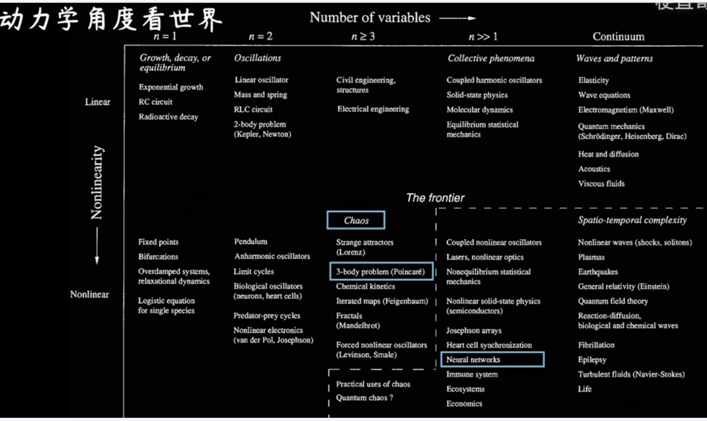

学期很快就到了期末。

虽然还是会有一些焦虑和应付了事的时候，但时间的自我掌控度极高，在快乐的时候会觉得这一年像是自己偷来的一样，弥足珍贵。

很高兴重新开始学习物理，也很幸运有很多奇奇怪怪的机会，看到了厉害的人。觉得能在某个方向基础扎实了解深入总是富有魅力的。在机构和学校合作的会议上看到大佬侃侃而谈计算机体系和城市规划之间架构上的相似性，觉得学习又多了些乐趣。

做初探神经网络的作业的过程中，看到梗直哥的解说，进而看到*Steven Strogatz*对非线性系统的分类：

混沌理论在中间，比三体问题非线性稍弱，神经网络维度更高，非线性也更强。免疫学，生态系统，经济型和量子理论都在其中 ，其复杂性来自非线性的不稳定 和对初值的敏感。

原来三体问题的维度低于神经网络，而Space Weather课程中涉及到的Plasma是更复杂的内容，属于时空复杂分析，这又与城市建模中的时空分析有多少联系呢？

