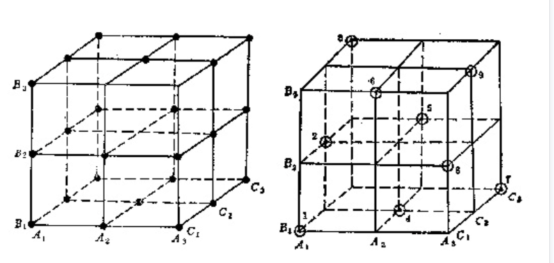
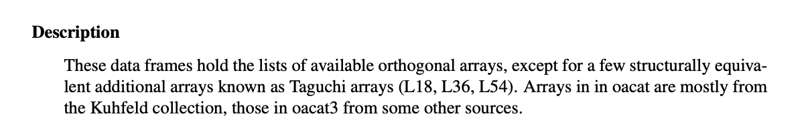
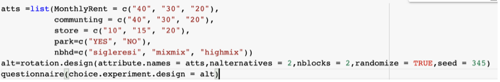
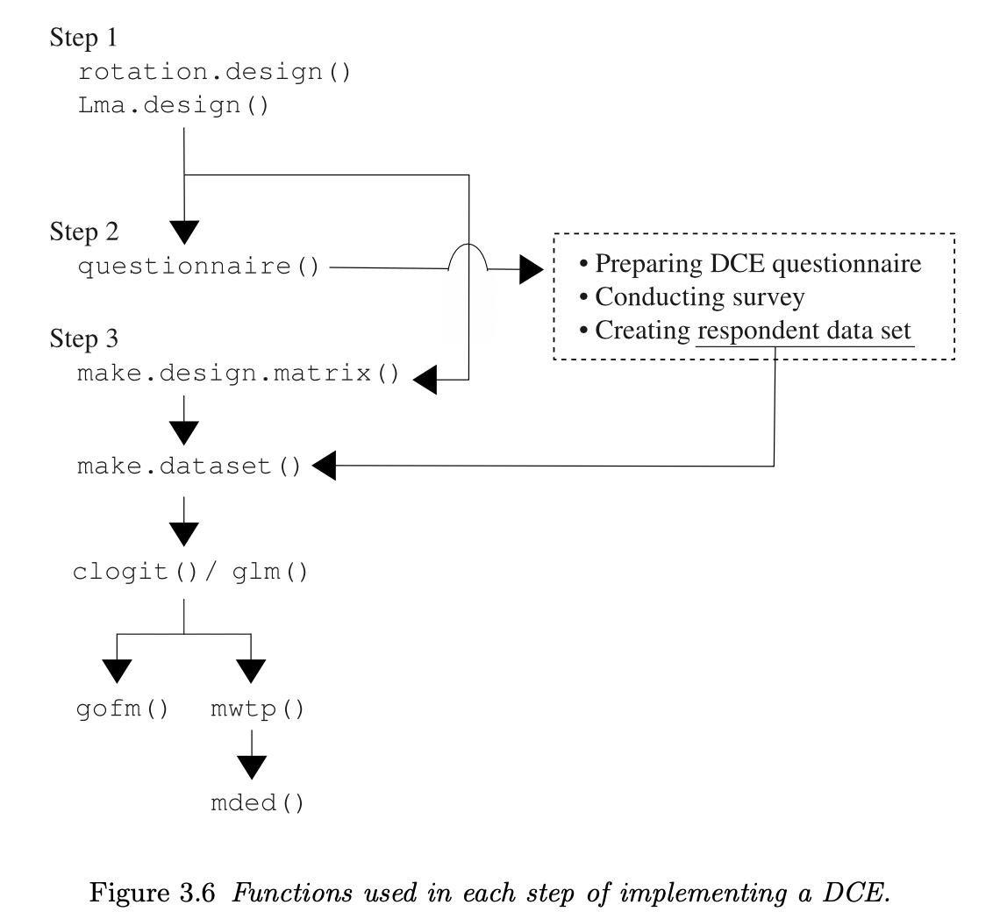

最近师姐在设计调查问卷，稍微了解了一下两种试验/测试方法

### 正交表法

OATS（Orthogonal Array Testing Strategy）

根据正交性从全面试验中挑选出部分有代表性的点进行试验，这些有代表性的点具备了“均匀分散，齐整可比”的特点。

日本统计学家田口玄一将正交试验选择的水平组合列成表格，称为正交表

**正交原理**

围绕“均匀分散，齐整可比”的特点，实现（1）每列中不同数字出现次数相等。表明每个因素的每个水平与其它因素的每个水平参与试验的几率是完全相同的（2）在任意两列其横向组成数字对中，每种数字对出现次数相等。保证了试验点均匀地分散在因素与水平的完全组合之中。

Example: 现在有一个组合有三因子，每个因子是三水平，权且用如下方式进行表示A(A1,A2,A3)，B(B1,B2,B3)，C(C1,C2,C3)，在左图的正方体中每个因子的每个水平代表的是一个面，共九个面，任意两个因子的水平之间都存在交点，共27（3x3x3）个，这就是笛卡尔积。按照两大特性设计出的正交表如右图所示，试验点用⊙表示。我们看到，在9个平面中每个平面上都恰好有三个点而每个平面的每行每列都有一个点，而且只有一个点，总共九个点。这样的试验方案，试验点的分布很均匀，试验次数也不多。

**正交表设计**

如果正交表类型不同，构造方法差异很大，甚至有些正交表其构造方法到目前还未解决。

目前现成的生成工具基本参照先前已公开的正交表模板进行设计以提高效率。

正交表模板：https://support.sas.com/techsup/technote/ts723_Designs.txt

**R包 support.CEs** 

https://cran.r-project.org/web/packages/support.CEs/index.html

首先通过调用oa.degisn 实现正交表法，得到正交主效应数列，作为第一个可替代项，然后通过rotation.design，在正交主效应基础上生成问卷设计者所需的其他替代项。

Example:

 

Attribute:属性因素

Nalterbatives: 可替换列个数（每道题选项个数）

Nblocks: 分块，能被正交主效应数组个数整除（一套题里几道题）

#### 实验设计步骤

#### rotation design/ mix and match

根据正交表生成的正交主成分数列（orthogonal main-effect arrays）构建alternative选项

mix and match 对 rotation design做了优化

### 配对测试

Pairwise/All-Pairs/N-wise

`Pairwise` 是 L. L. Thurstone 在 1927 年首先提出来的。他是美国的一位心理统计学家。`Pairwise` 是基于数学统计和对传统的正交分析法进行优化后得到的产物。

`Pairwise` 基于如下 2 个假设：

- 每一个维度都是正交的，即每一个维度互相都没有交集；
- 根据数学统计分析，73% 的缺陷（单因素是 35%，双因素是 38%）是由单因素或两个因素相互作用产生的。19% 的缺陷是由三个因素相互作用产生的。

因此，`Pairwise` 基于覆盖所有两因素的交互作用产生的用例集合性价比最高而产生的。

python 库 allpairspy

https://github.com/thombashi/allpairspy

https://cran.r-project.org/web/packages/DoE.base/DoE.base.pdf
